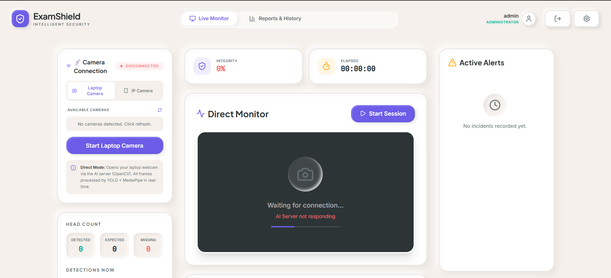
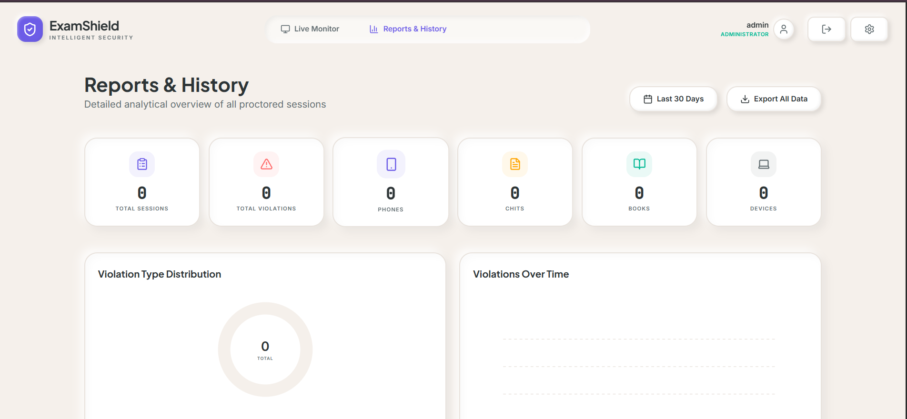
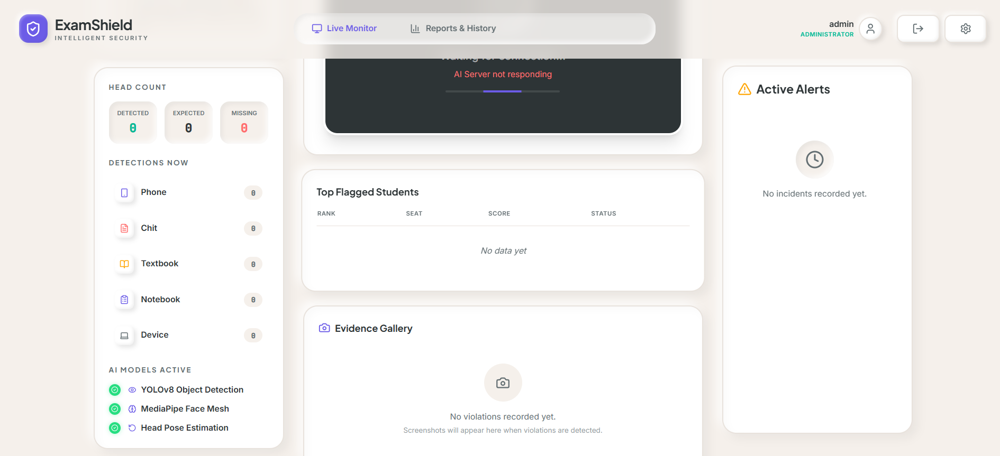
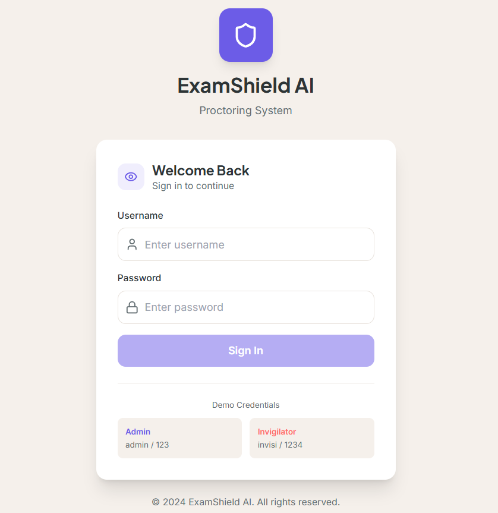
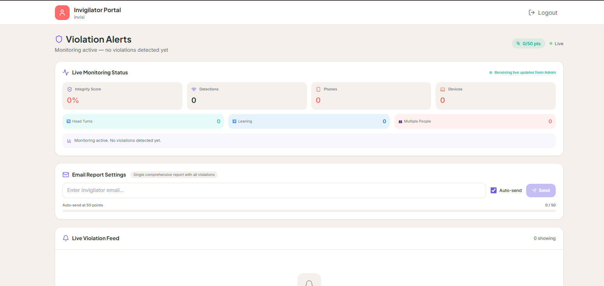

# 🎓 ExamShield AI - AIAC PROJECT

[](https://github.com/2303A51795/AIAC-PROJECT)
[](https://reactjs.org/)
[](https://www.typescriptlang.org/)
[](https://python.org/)
[](https://ultralytics.com/)
[](https://spring.io/)

> **AI-Powered Smart Examination Integrity System** using Embedded Camera Processing, Mobile Integration, and a Web-Based Monitoring Platform for Automated Malpractice Detection in Educational Institutions.

---

## 📌 Project Information

| Field | Details |
|-------|---------|
| **Project Name** | AIAC PROJECT - ExamShield AI |
| **Author** | VIGHNESH BACHWAL |
| **Roll Number** | 2303A51795 |
| **Section** | BATCH 12 |
| **Year** | 3RD YEAR CSE BTECH |
| **GitHub Repository** | [https://github.com/2303A51795/AIAC-PROJECT](https://github.com/2303A51795/AIAC-PROJECT) |

---

## 📸 Screenshots

<div align="center">
  
  <p><em>Live Monitoring Dashboard with Real-time Detection</em></p>
</div>

<div align="center">
  
  <p><em>AI-Powered Violation Detection & Alert System</em></p>
</div>

<div align="center">
  
  <p><em>Camera Connection & System Configuration</em></p>
</div>

<div align="center">
  
  <p><em>Integrity Scoring & Evidence Management</em></p>
</div>

<div align="center">
  
  <p><em>Comprehensive Reports & Analytics</em></p>
</div>

---

## ✨ Features

### 🔍 AI-Powered Detection Engine
- **YOLOv8 Object Detection** - Detects phones, chits, textbooks, notebooks, electronic devices
- **MediaPipe Head Pose Estimation** - Analyzes head movements and gaze direction
- **ByteTrack Person Tracking** - Persistent multi-person tracking with unique IDs
- **3-Phase Detection System**:
  1. **Head Count** - Automatic student counting and attendance verification
  2. **Behavior Analysis** - Suspicious posture and movement detection
  3. **Prohibited Item Detection** - Real-time detection of cheating materials

### 📱 Multi-Platform Input
- **Mobile Camera Connection** - Use any smartphone as a wireless IP camera (DroidCam/IP Webcam)
- **Video Upload** - Process pre-recorded examination footage
- **Direct Webcam** - Built-in laptop camera support

### 🎨 Modern UI/UX
- **Claymorphism Design** - Soft, modern 3D-like interface
- **Fully Responsive** - Works seamlessly on laptop and mobile devices
- **Real-time Alerts** - Instant notifications for invigilators
- **Evidence Capture** - Automatic screenshot and video clip extraction

---

## 🏗️ System Architecture

```
+---------------------------------------------------------+
|                    VIDEO INPUT SOURCES                   |
|  +--------------------+      +--------------------+      |
|  |  Mobile Camera     |      |  Video Upload      |      |
|  |  (DroidCam/IP Webcam)    |  (MP4/AVI/MOV)     |      |
|  +---------+----------+      +---------+----------+      |
+------------+---------------------------+-----------------+
             |                           |
             v                           v
+---------------------------------------------------------+
|              EMBEDDED AI PROCESSING ENGINE               |
|  +------------+  +------------+  +------------+         |
|  | Phase 1:   |  | Phase 2:   |  | Phase 3:   |         |
|  | Head Count |->| Behavior   |->| Prohibited |         |
|  | (YOLOv8)   |  | Analysis   |  | Items      |         |
|  |            |  | (MediaPipe)|  | (YOLOv8)   |         |
|  +------------+  +------------+  +------------+         |
|                        |                                |
|                        v                                |
|            +------------------+                         |
|            |  Scoring Engine  |                         |
|            | & Alert System   |                         |
|            +------------------+                         |
+---------------------------------------------------------+
                        |
                        v
+---------------------------------------------------------+
|              WEB APPLICATION (React + Spring Boot)       |
|  +------------+  +------------+  +------------+         |
|  | Live Monitor| |   Upload   |  |   Reports  |         |
|  |  Dashboard  | | & Analyze  |  |   History  |         |
|  +------------+  +------------+  +------------+         |
+---------------------------------------------------------+
```

---

## 🚀 Quick Start

### Prerequisites
- **Node.js** 18+ and **npm**
- **Python** 3.11+
- **Java** 17+
- **Git**

### Installation

```bash
# Clone the repository
git clone https://github.com/2303A51795/AIAC-PROJECT.git
cd AIAC-PROJECT

# Install frontend dependencies
npm install

# Install AI backend dependencies
cd ai_backend
python -m venv venv
venv\Scripts\activate  # Windows
pip install -r requirements.txt
cd ..

# Backend uses Maven wrapper (no installation needed)
```

### Running the Application

```bash
# Start all services (Windows)
start-examshield.bat

# Or start individually:
npm run dev                              # Frontend (Vite) - Port 5173
cd ai_backend && python src/detector.py  # AI Backend - Port 5000
cd backend && mvnw.cmd spring-boot:run    # Spring Boot Backend - Port 8080
```

---

## 🛠️ Technology Stack

### Frontend
| Technology | Purpose |
|------------|---------|
| React 19 | UI Framework |
| TypeScript | Type Safety |
| Tailwind CSS | Styling |
| Framer Motion | Animations |
| Lucide React | Icons |
| Vite | Build Tool |

### Backend
| Technology | Purpose |
|------------|---------|
| Spring Boot 3.2 | REST API Server |
| SQLite | Database |
| JPA/Hibernate | ORM |
| Maven | Build Tool |

### AI/ML Backend
| Technology | Purpose |
|------------|---------|
| YOLOv8 | Object Detection |
| MediaPipe | Pose Estimation |
| OpenCV | Video Processing |
| NumPy | Numerical Computing |
| Flask | API Server |

---

## 📊 Detection Capabilities

### Violation Types & Scoring

| Violation Type | Points | Severity |
|----------------|--------|----------|
| Phone Detected | 30 | High |
| Chit/Slip Detected | 25 | High |
| Textbook Detected | 30 | High |
| Notebook Detected | 25 | Medium |
| Electronic Device | 20 | Medium |
| Head Turn (Sustained) | 10 | Low |
| Looking at Neighbor | 8 | Low |
| Leaning Toward Other | 10 | Medium |
| Passing Gesture | 15 | Medium |
| Head Count Mismatch | 40 | High |
| Extra Person in Hall | 50 | Critical |

---

## 🔗 Links

- **Repository**: [https://github.com/2303A51795/AIAC-PROJECT](https://github.com/2303A51795/AIAC-PROJECT)

---

## 📝 License

This project is licensed under the MIT License - see the [LICENSE](LICENSE) file for details.

---

## 👨‍💻 Author

**VIGHNESH BACHWAL**

- **Roll Number**: 2303A51795
- **Section**: BATCH 12
- **Year**: 3RD YEAR CSE BTECH
- **GitHub**: [https://github.com/2303A51795](https://github.com/2303A51795)

---

<div align="center">
  <p>Made with React, TypeScript, Python, Spring Boot, and YOLOv8</p>
  <p>(c) 2026 ExamShield AI - AIAC PROJECT. All rights reserved.</p>
</div>
